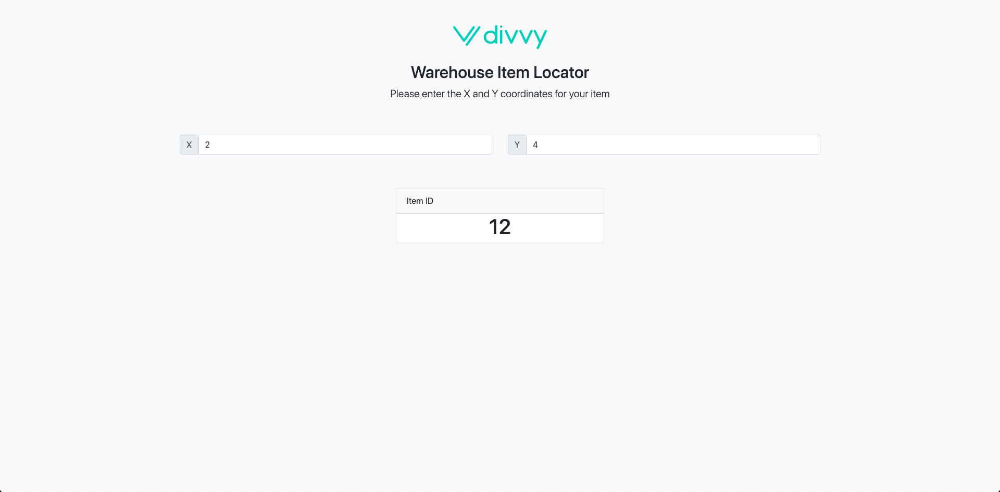

# Divvy React Challenge




## Getting Started

These instructions will get you a copy of the project up and running on your local machine for development and testing purposes.

### Installing


Clone the repository

```
git clone [repositoryURL]
```

To start your Phoenix server:

  * Install dependencies with `mix deps.get`
  * Install Node.js dependencies with `cd assets && npm install`
  * Start Phoenix endpoint with `mix phx.server`

Now you can visit [`localhost:4000`](http://localhost:4000) from your browser.


## Built With

* React
* Phoenix

## TODO

* Build out tests
* Remove unnecessary boilerplate code
